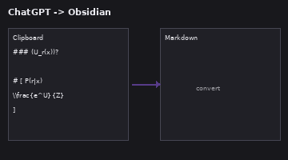
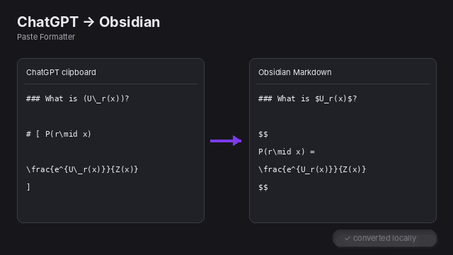

# ChatGPT Paste Formatter

> An Obsidian plugin that repairs Markdown and mathematical notation copied from ChatGPT before it lands in your notes.

[](https://obsidian.md)
[](https://github.com/Lortzing/obsidian-chatgpt-paste-formatter/releases/latest)
[](https://github.com/Lortzing/obsidian-chatgpt-paste-formatter/actions/workflows/lint.yml)
[](LICENSE)

**Copy from ChatGPT → paste into Obsidian → keep formulas and Markdown readable.**

ChatGPT can place visually correct formulas on the clipboard in a form that does not survive a normal paste into Obsidian. Display equations may become stray `[ ... ]` blocks, heading markers can appear in front of formulas, math escapes such as `U\_r` can remain in the note, and relations can occasionally degrade into strings such as `\===`.

ChatGPT Paste Formatter detects and repairs these clipboard artifacts locally while protecting fenced code blocks and inline code.

> [!NOTE]
> This project is currently in beta and is **not yet listed in Obsidian Community Plugins**. BRAT is the recommended installation method for testing.

## Demo

<p align="center">
  
</p>

<details>
<summary>Static preview</summary>

<p align="center">
  
</p>

</details>

The images are product demonstrations of the transformation rather than screenshots of a particular Obsidian theme.

## Example

### Copied from ChatGPT

```text
### 1. (U\_r(x)) 是什么？

# [ P(r\mid x)

\frac{e^{U\_r(x)}}{Z(x)}
]
```

### After conversion

```markdown
### 1. $U_r(x)$ 是什么？

$$
P(r\mid x) =
\frac{e^{U_r(x)}}{Z(x)}
$$
```

## Features

- **Paste with conversion** from the command palette.
- **Convert the current selection or note** after content has already been pasted.
- A persistent **right-side converter** with vertically stacked source/result panes.
- Mouse or keyboard selection in the editor automatically syncs into the converter sidebar.
- Sidebar actions for **Apply to original selection**, **Copy result**, and **Clear**.
- Optional automatic paste conversion with three modes:
  - Off
  - Detected ChatGPT/math copies only *(default)*
  - Always
- Selectable interface language:
  - Default — follow Obsidian
  - 中文
  - English
- Converts explicit LaTeX delimiters:
  - `\(...\)` → `$...$`
  - `\[...\]` → `$$...$$`
- Repairs damaged display-math forms such as standalone `[ ... ]` blocks and `# [ ... ]` clipboard artifacts.
- Uses permissive structure-based recovery for standalone `[ ... ]` blocks, including simple variables, numbers, vectors, sets, arithmetic, relations, functions, scripts, LaTeX commands, and matrices.
- Rejects obvious non-math bracket blocks such as prose, Markdown lists/headings, URLs, fenced code, and quoted string data.
- Normalizes escaped math tokens such as `U\_r` → `U_r` inside detected math.
- Collapses repeated relation artifacts such as `\===` and `\========` to `=` *(enabled by default)*.
- Merges adjacent display-math blocks when the second block clearly continues the same derivation *(enabled by default)*.
- Heuristically recognizes inline expressions such as `(x)` and `(U\_r(x))`.
- Protects fenced code blocks and inline code from math conversion.
- Manual conversions always report the result; automatic conversion notices can be enabled separately.
- No network requests, telemetry, accounts, API keys, or external services.

## Usage

### Right-side manual converter

Select text in a note, then use either:

- Command palette → **Open converter sidebar for selection or current note**
- Editor context menu → **Open in converter sidebar**

The sidebar is arranged vertically:

```text
┌─────────────────────────────┐
│ Selected / source text      │
│                             │
│ editable source             │
├─────────────────────────────┤
│ Converted result            │
│                             │
│ live converted output       │
├─────────────────────────────┤
│ Clear   Copy result   Apply │
└─────────────────────────────┘
```

While the sidebar is open, selecting text in the editor with the mouse or keyboard automatically replaces the source pane and refreshes the converted result. The source pane is editable, so you can also make manual adjustments before applying.

**Apply to original selection** writes the current converted result back to the selection that populated the sidebar. **Copy result** copies the converted Markdown without modifying the note.

### Other manual commands

| Command | What it does |
| --- | --- |
| **Paste with conversion** | Reads the clipboard, converts supported artifacts, and inserts the result. |
| **Convert selection or current note** | Converts the current selection; if nothing is selected, converts the whole note immediately. |
| **Open converter sidebar for selection or current note** | Opens the right-side source/result workflow before applying changes. |

Manual conversion actions always show a result notice so that an explicit action never fails silently.

### Automatic paste conversion

By default, regular paste uses **Detected ChatGPT/math copies only**. The plugin does not have access to reliable clipboard provenance and therefore does not literally know that the source application was ChatGPT. Instead, it computes a heuristic score from textual signatures commonly produced by ChatGPT/math clipboard output.

Automatic conversion runs when the score is at least **2**. Current signals include:

| Signal | Score |
| --- | ---: |
| Explicit `\(...\)` math | +2 |
| Explicit `\[...\]` math | +2 |
| Malformed heading-style `# [ ... ]` block | +5 |
| Standalone multiline `[ ... ]` block | +4 |
| One escaped underscore such as `U\_r` | +1 |
| Two or more escaped underscores | +2 |
| One recognized LaTeX command | +1 |
| Three or more recognized LaTeX commands | +2 |
| Repeated equals artifact such as `\===` | +2 |
| Empty emphasis artifact such as `** **` | +1 |

This detector decides **whether automatic paste should invoke the converter**. Once a standalone `[ ... ]` block reaches the converter, block-level math recovery uses the broader structural rules described below.

## Standalone `[ ... ]` math recovery

ChatGPT sometimes loses the backslashes from `\[` and `\]`, leaving only standalone square-bracket lines. These blocks are now treated permissively: the converter prefers recovering them as display math unless there is strong evidence that the contents are ordinary text or Markdown.

Examples that are accepted include:

```text
[
42
]

[
x
]

[
x+y
]

[
U-m=[-2,-1,0].
]

[
e^{1000}, e^{1001}, e^{1002}
]

[
P(A|B)
]

[
\sqrt{2}
]

[
\begin{bmatrix}
1 & 2 \\ 3 & 4
\end{bmatrix}
]
```

Obvious non-math content is still rejected, for example:

```text
[
This is ordinary prose.
]

[
这是普通文本。
]

[
https://example.com
]

[
- list item
]
```

This is intentionally more permissive than the earlier score-only display-math heuristic. It is not based on whether MathJax merely “does not throw”: many non-mathematical strings are technically renderable by TeX/MathJax, so render success alone is not a reliable semantic validator.

## What gets repaired

| Clipboard form | Obsidian output |
| --- | --- |
| `\(x\)` | `$x$` |
| `\[x\]` | `$$ x $$` |
| multiline `[ ... ]` math block | `$$ ... $$` |
| malformed `# [ ... ]` math block | `$$ ... $$` |
| `U\_r` inside math | `U_r` |
| `\===` / `\========` inside math | `=` |
| adjacent derivation block beginning with `=` or `\approx` | merged into the previous display block |
| obvious inline math such as `(U\_r(x))` | `$U_r(x)$` |

The plugin repairs syntax and high-confidence structural corruption. It does not invent mathematical symbols or operators that are completely absent from the clipboard text.

## Installation

### BRAT — recommended for beta testing

1. Install **BRAT** from Obsidian Community Plugins.
2. Open the command palette and run **BRAT: Add a beta plugin for testing**.
3. Enter:

   ```text
   Lortzing/obsidian-chatgpt-paste-formatter
   ```

4. Enable **ChatGPT Paste Formatter** under **Settings → Community plugins**.

### GitHub Releases

Download `main.js`, `manifest.json`, and `styles.css` from the matching GitHub Release and place them in:

```text
<Vault>/.obsidian/plugins/chatgpt-paste-formatter/
```

Reload Obsidian and enable the plugin.

### Build from source

Requirements: Node.js and npm.

```bash
git clone https://github.com/Lortzing/obsidian-chatgpt-paste-formatter.git
cd obsidian-chatgpt-paste-formatter
npm ci
npm run check
```

Copy `main.js`, `manifest.json`, and `styles.css` into the plugin directory shown above.

## Settings

Settings are organized into **General**, **Paste behavior**, **Math detection**, **Repair rules**, and **Notifications**.

### General

#### Interface language

Choose **Default (follow Obsidian)**, **中文**, or **English**. Settings, context menus, sidebar UI, notices, and command palette names update immediately.

### Paste behavior

#### Automatic paste conversion

- **Off** — never intercept ordinary paste.
- **Detected ChatGPT/math copies only** — default; convert only when the detector score is at least 2.
- **Always** — run the converter for every ordinary paste.

### Math detection

#### Inline math detection

This setting only controls heuristic conversion of ordinary parentheses such as `(x)`. Explicit LaTeX delimiters are handled separately.

- **Strict** — requires strong mathematical syntax inside the parentheses. A plain `(x)` is normally left alone.
- **Balanced** — default. Includes Strict behavior and also recognizes simple variables in mathematical/prose context, for example `其中 (x) 表示...`.
- **Aggressive** — includes Balanced behavior and accepts more short variable/function-like parenthesized expressions when contextual evidence is weaker. It has the highest false-positive risk.

The converter still avoids obvious non-math cases such as URLs, Markdown link destinations, and plain numeric parenthetical text.

#### Convert LaTeX delimiters

Converts `\(...\)` and `\[...\]` into Obsidian `$...$` and `$$...$$` syntax.

#### Repair copied display math

Repairs malformed standalone `[ ... ]` and heading-style `# [ ... ]` blocks. Standalone bracket blocks use permissive structure-based recognition with explicit safeguards for prose and Markdown.

### Repair rules

#### Normalize escaped math symbols

Inside detected math, converts clipboard escapes such as `U\_r` and `\+` back to `U_r` and `+`.

#### Collapse repeated equals signs

Enabled by default. Converts repeated-equals clipboard artifacts such as `\===` and `\========` to one `=` inside recognized math blocks.

#### Merge adjacent display-math continuations

Enabled by default. Adjacent display blocks are merged only when there is strong evidence of a continuous derivation — for example, the next formula begins with `=`, `\approx`, `\equiv`, `\sim`, `\leq`, `\geq`, an arrow, or another continuation operator.

#### Repair obvious missing relation

For a narrow class of malformed `# [ LHS ... ]` clipboard blocks, the plugin can restore an `=` when the first two lines look unambiguously like the left- and right-hand sides of an equation.

#### Clean empty emphasis artifacts

Off by default because removing empty emphasis markers can alter neighboring Markdown emphasis in unusual clipboard content.

### Notifications

Manual conversion actions always show a result notice. **Automatic conversion notices** only controls notifications produced by intercepted ordinary paste and is off by default.

## Development

```bash
npm ci
npm run dev
```

Quality checks:

```bash
npm test
npm run lint
npm run build
# or all three:
npm run check
```

### Project structure

```text
src/
├── main.ts            # Obsidian plugin integration
├── converter.ts       # clipboard/text conversion engine
├── formatter.ts       # pre-recovery pipeline for damaged clipboard blocks
├── converter-view.ts  # right-side manual converter UI
├── i18n.ts            # English/Chinese localization
└── settings.ts        # plugin settings UI

assets/                # README demo assets
examples/              # representative ChatGPT input/output samples
scripts/               # converter test/demo helpers
manifest.json          # Obsidian plugin manifest
versions.json          # plugin → minimum Obsidian compatibility map
styles.css             # plugin UI styles
```

The conversion engine is kept separate from the Obsidian UI so it can be tested independently.

## Privacy

All conversion happens locally in memory. The plugin does not send note or clipboard content anywhere and does not include telemetry.

## Limitations

Clipboard representations can lose information before Obsidian receives the text. If an operator, symbol, or part of an equation is completely absent from the copied text, the plugin cannot reliably infer it.

For important equations or large notes, use the **right-side converter** before applying changes.

Mobile support is intended, but clipboard permission and sidebar behavior can vary by operating system and should be beta-tested on real devices.

## Roadmap

- Expand regression coverage with more real ChatGPT clipboard samples.
- Continue improving malformed display-math recovery while measuring false positives.
- Reduce false positives in inline-math detection.
- Run a BRAT public beta.
- Submit to the Obsidian Community Plugins directory after beta validation.

## Contributing

Bug reports and real-world examples of broken ChatGPT clipboard output are especially useful. Please open an issue with:

1. the text copied from ChatGPT,
2. the current conversion result, and
3. the expected Obsidian Markdown.

Pull requests are welcome.

## License

[MIT](LICENSE)
